# System Architecture

## High-Level Architecture

```mermaid
flowchart TB
    subgraph Source["📥 Data Source"]
        A[("Kaggle Dataset<br/>Ukraine Tweets")]
    end

    subgraph Storage["💾 Data Storage"]
        B[("data/raw/*.csv")]
    end

    subgraph Orchestration["🔄 Apache Airflow"]
        C["twitter_sentiment_dag.py"]
    end

    subgraph Processing["⚡ Apache Spark"]
        D["sentiment_analysis.py<br/>• Text Cleaning<br/>• Sentiment Analysis<br/>• HuggingFace Model"]
    end

    subgraph Output["📁 Processed Results"]
        E[("data/processed/*.csv")]
    end

    subgraph Analytics["📊 Analytics Layer"]
        F[("PostgreSQL<br/>Metadata")]
        G[("Apache Druid<br/>OLAP")]
    end

    subgraph Visualization["📈 Visualization"]
        H["Apache Superset<br/>Dashboards"]
    end

    subgraph Governance["🔍 Governance"]
        I["OpenMetadata<br/>Lineage & Quality"]
    end

    A --> B
    B --> C
    C --> D
    D --> E
    E --> F
    E --> G
    G --> H
    F --> I
```

## Component Details

### 1. Data Ingestion Layer

-   **Source**: Kaggle Ukraine-Russia Crisis Twitter Dataset
-   **Format**: CSV (1.2M rows)
-   **Storage**: Local filesystem mounted to containers

### 2. Orchestration Layer

-   **Apache Airflow**
    -   Webserver: Port 8080
    -   Scheduler: Background process
    -   Executor: LocalExecutor
    -   Backend: PostgreSQL

### 3. Processing Layer

-   **Apache Spark**
    -   Master Node: Port 8081
    -   Worker Node(s): Configurable
    -   Processing: Distributed sentiment analysis
    -   ML Model: Hugging Face Transformers

### 4. Storage Layer

-   **PostgreSQL**

    -   Port: 5432
    -   Databases: airflow, druid, superset, openmetadata
    -   Purpose: Metadata storage

-   **Apache Druid**
    -   Router: Port 8888
    -   Broker: Port 8083
    -   Coordinator: Port 8082
    -   Historical: Port 8084
    -   Purpose: Fast OLAP queries

### 5. Visualization Layer

-   **Apache Superset**
    -   Port: 8088
    -   Connected to: Druid, PostgreSQL
    -   Dashboards: Pre-configured sentiment charts

### 6. Governance Layer

-   **OpenMetadata**
    -   Port: 8585
    -   Elasticsearch: Port 9200
    -   Purpose: Data lineage, quality, governance

## Data Flow

1. **Ingestion**: CSV file placed in `data/raw/`
2. **Orchestration**: Airflow DAG triggers pipeline
3. **Processing**: Spark reads CSV, cleans text, analyzes sentiment
4. **Storage**: Results saved to `data/processed/`
5. **Analytics**: Druid ingests processed data
6. **Visualization**: Superset queries Druid for dashboards
7. **Governance**: OpenMetadata tracks lineage across all components

## Network Architecture

All services communicate via Docker bridge network: `sentiment-network`

## Volume Mounts

-   `./data` → `/opt/airflow/data`, `/opt/spark-data`, `/opt/druid/data`
-   `./airflow/dags` → `/opt/airflow/dags`
-   `./spark` → `/opt/spark-apps`
-   Named volumes for persistent data

## Security Considerations

⚠️ **Note**: This is a local development setup. For production:

1. Change all default passwords
2. Enable SSL/TLS for all services
3. Implement proper authentication
4. Use secrets management (Vault, AWS Secrets Manager)
5. Enable network policies
6. Scan images for vulnerabilities
7. Implement RBAC
8. Enable audit logging

## Scalability

To scale horizontally:

1. Add more Spark workers in `docker-compose.yml`
2. Increase Druid historical nodes
3. Use external databases (RDS, Cloud SQL)
4. Deploy to Kubernetes with Helm charts
5. Use distributed filesystems (HDFS, S3)

## High Availability

For production HA:

1. Run multiple Airflow schedulers
2. Use CeleryExecutor with Redis
3. Deploy Druid with multiple replicas
4. Use managed databases
5. Implement load balancers
6. Set up monitoring with Prometheus/Grafana
